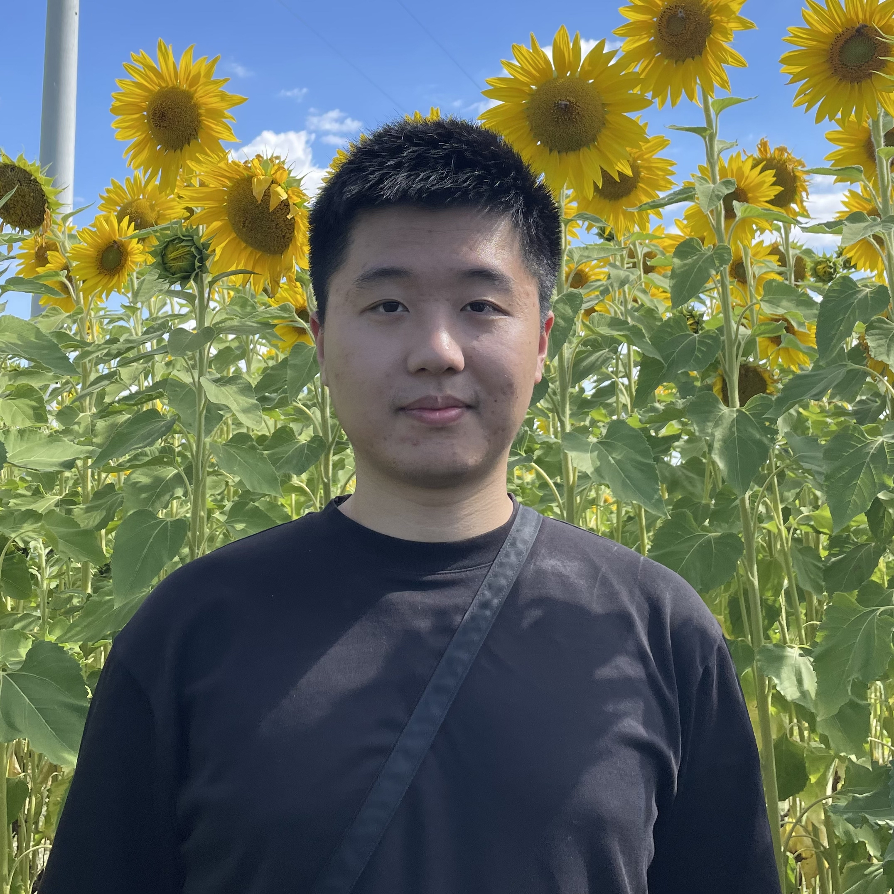

## Hello! 你好！

I'm a PhD student at Department of Computer Science, [Princeton University](https://www.princeton.edu). I finished my undergraduate studies from the [Australian National University](https://www.anu.edu.au) in Dec 2023. My major is Computer Science and my specialisation is Computer Systems and Architecture.

My research interest lies in computational biology, where I develop novel algorithms to solve problems arise in computational genomics. You can check my résumé [here](files/Runpeng_Luo_Curriculum_Vitae.pdf).
