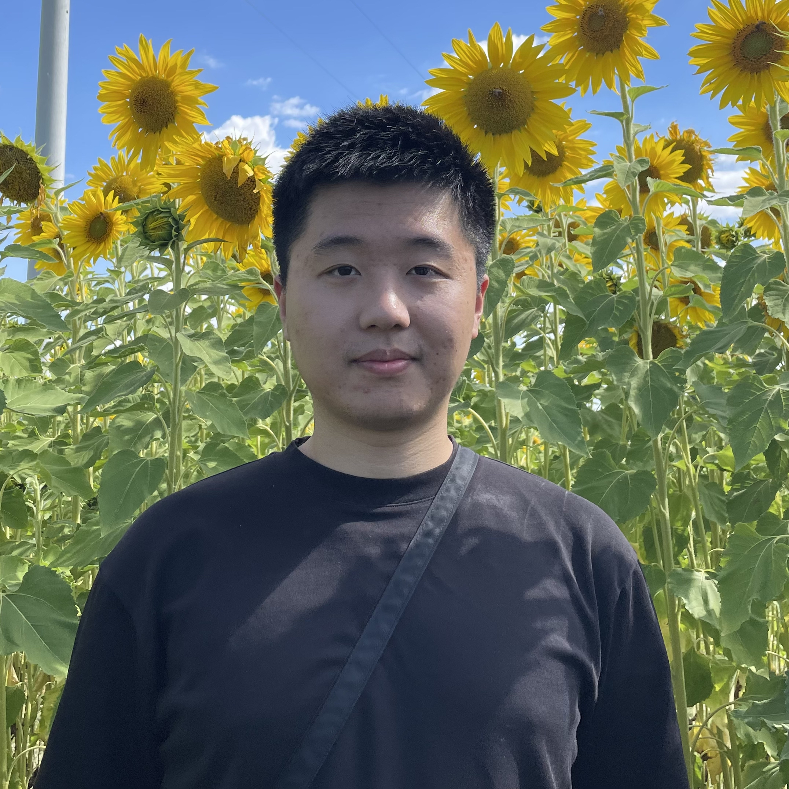

## Hello! 你好！

I'm a PhD candidate at Department of Computer Science, [Princeton University](https://www.princeton.edu). I finished my undergraduate studies (major in Computer Science and specialisation in Computer Systems and Architecture) from the [Australian National University](https://www.anu.edu.au) in Dec 2023.

My research interest lies in computational biology, where I develop and implement algorithms to solve problems arise in computational genomics. Currently I'm interested in inferring complex somatic variations in cancer genomics and tumor evolutions using wide range of sequencing technologies including bulk short/long read DNA sequencing, single-cell sequencing, and spatial transcriptomics. You can check my résumé [here](files/Runpeng_Luo_Curriculum_Vitae.pdf).
